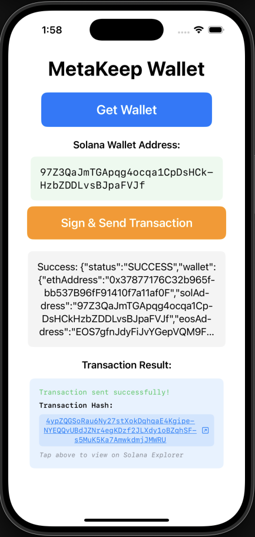

# iOS MetaKeep Wallet Integration

A SwiftUI iOS application demonstrating MetaKeep wallet integration with Solana blockchain transactions.



## Features

- MetaKeep wallet creation and management
- Solana transaction signing using MetaKeep SDK
- Transaction submission to Solana devnet


## Configure custom URL scheme
MetaKeep uses a custom URL scheme to send data back to your app after the user's operation.

Navigate to the Info tab of your app target settings in XCode. In the URL Types section, click the ＋ button to add a new URL. Enter the following values:

Identifier: metakeep
URL Schemes: $(PRODUCT_BUNDLE_IDENTIFIER)


## Dependencies

### Swift Package Manager
- **MetaKeepSDK**: `https://github.com/PassbirdCo/MetaKeepSDK` (v2.0.3)
- **SolanaSwift**: `https://github.com/p2p-org/solana-swift` (v5.0.0)

### Installation
Add these packages to your Xcode project via Swift Package Manager.

## Implementation

### 1. MetaKeep SDK Setup

```swift
import MetaKeep

// Initialize SDK in App
static let sdk = MetaKeep(appId: "YOUR_APP_ID", appContext: AppContext())

// Handle deep links
.onOpenURL { url in
    MetaKeep.companion.resume(url: url.description)
}
```

**Note:** You must replace `YOUR_APP_ID` with your own MetaKeep App ID in the following file:
- **File:** `iOS-SVM-App/iOS_SVM_AppApp.swift`
- **Line:** 18
- **Current:** `static let sdk = MetaKeep(appId: "YOUR_METAKEEP_APP_ID", appContext: AppContext())`

### 2. Get Wallet

```swift
sdk.getWallet(
    callback: Callback(
        onSuccess: { (result: JsonResponse) in
            // Parse wallet addresses from result.description
            // Extract solAddress for Solana operations
        },
        onFailure: { (error: JsonResponse) in
            // Handle wallet creation failure
        }
    )
)
```

### 3. Sign Transaction

```swift
// Build Solana transaction using SolanaSwift
let transaction = try await buildSolanaTransaction()

// Serialize transaction message for MetaKeep
let message = try transaction.compileMessage()
let serializedMessage = try message.serialize()
let serializedHex = "0x" + serializedMessage.map { String(format: "%02x", $0) }.joined()

// Create transaction object for MetaKeep
let txnObject = """
{
    "serializedTransactionMessage": "\(serializedHex)"
}
"""

// Sign with MetaKeep SDK
sdk.signTransaction(
    transaction: try JsonRequest(jsonString: txnObject),
    reason: "Transfer SOL",
    callback: Callback(
        onSuccess: { (result: JsonResponse) in
            // Extract signature from result.description
        },
        onFailure: { (error: JsonResponse) in
            // Handle signing failure
        }
    )
)
```

### 4. Send Transaction

```swift
// Add signature to transaction
var signedTransaction = transaction
signedTransaction.signatures = [SolanaSwift.Signature(signature: signatureBytes, publicKey: transaction.feePayer!)]

// Serialize and send to Solana
let serializedTransaction = try signedTransaction.serialize()
let base64Transaction = serializedTransaction.base64EncodedString()

// Send via RPC
let txHash: String = try await apiClient.request(method: "sendTransaction", params: [base64Transaction, SendTxParams()])
```

## Configuration

- **Solana Network**: Devnet (`https://api.devnet.solana.com`)
- **Transaction Type**: SOL transfer (0.001 SOL)
- **Recipient**: `6xEeDTksyAhBz7QBgzPmYxJN2zbmT7twx5rr1ejnaona`

## Requirements

- iOS 13.0+
- Xcode 14.0+
- Swift 5.0+

## Usage

1. Tap "Get Wallet" to create MetaKeep wallet
2. Tap "Sign & Send Transaction" to initiate transaction
3. Approve transaction in MetaKeep signing UI
4. View transaction result with clickable Solana Explorer link
